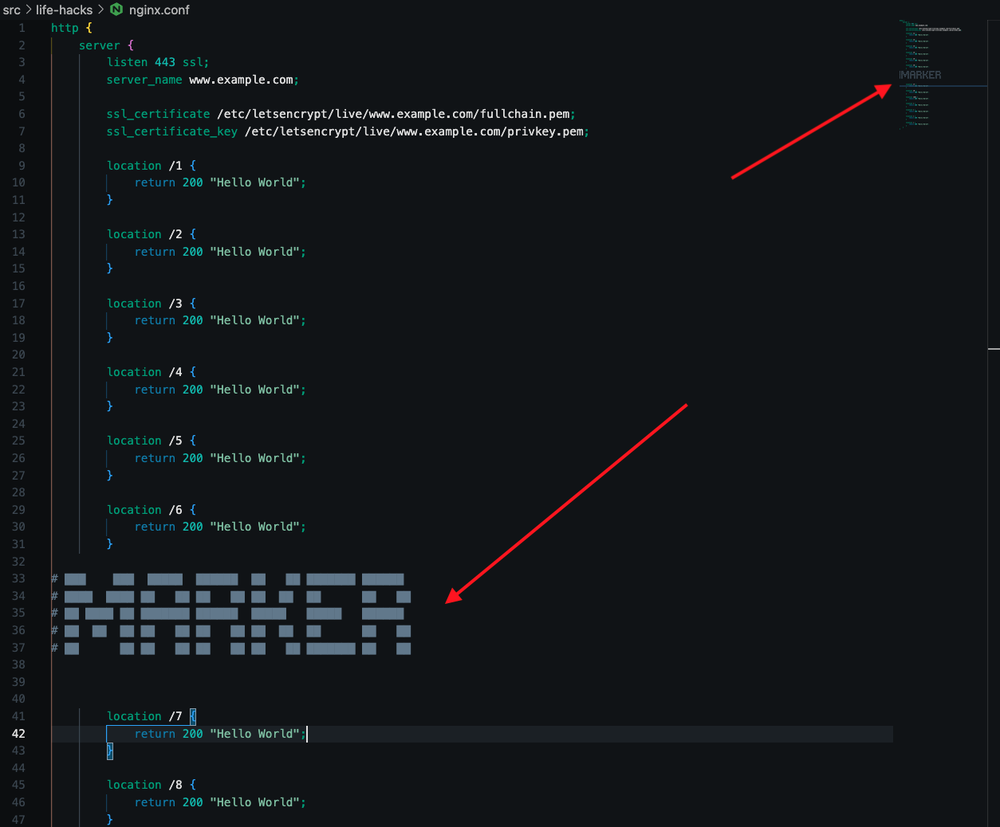

# Life Hacks for Development

## Gutter Navigation

When you have a large file, you can use the gutter to navigate to a specific line. But to make this actually useful, adding large text to a file will render in the gutter as something readable. This helps you navigate to a specific section.

Example; using this [ansi art generator](http://patorjk.com/software/taag/#p=display&f=ANSI%20Regular&t=MARKER) to add text as a comment in a large nginx config enables me to read the navigation on the gutter to the right side.

